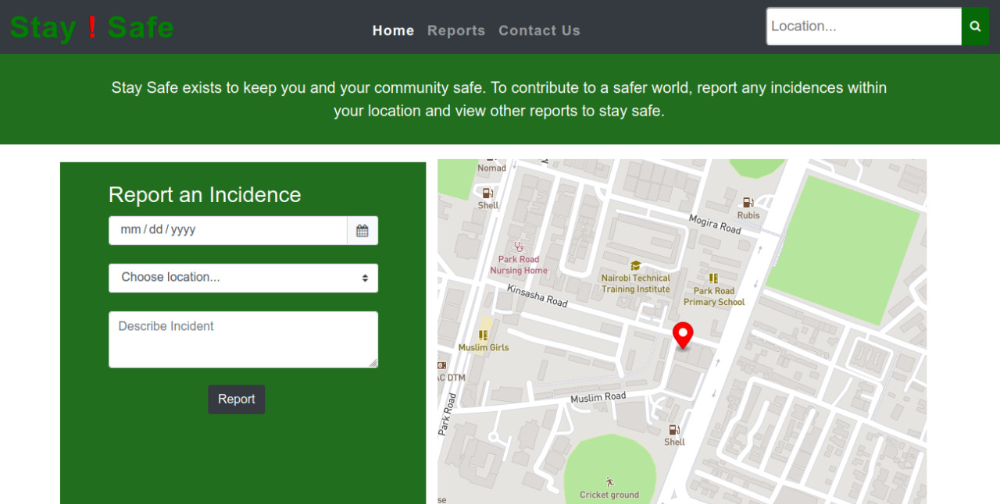

# Stay Safe 

### By Group 6 
### It is a description of Stay Safe Application

## Table of Content

+ [Description](#description)
+ [Project Images](#project-images)
+ [Requirements](#requirements)
+ [Technology Used](#technology-used)
+ [Licence](#licence)
+ [Authors Info](#author-Info)

## Description

 Stay Safe is a Danger tracking software application that allows users to input messages and location of dangerous incidence happening in their area. These danger zones are then tracked and then displayed as hotspots on a map. 

## Project Images

### Requirements

* Either a computer,phone,tablet or an Ipad

* An access to the Internet

[Go Back to the top](#portfolio)

## Technology Used

* Figma - Design Project

* Github Projects- Group Collaboration

* Bootstrap -To style the pages

* CSS - which was used to style the pages 

* HTML - build the structure of the pages.

* Javascript - To enhance functionality

* Mapbox - Generate map

## Authors Info

<a href="https://github.com/Dindihub"> Git hub</a> -Sandra Dindi   
 <a href="https://github.com/KakushaVenecia"> Git hub - Kakusha Venecia</a>  
  <a href="https://github.com/KakushaVenecia"> Git hub - Kakusha Venecia</a>  
<a href="https://github.com/KakushaVenecia"> Git hub - Kakusha Venecia</a>  

[Tanatwanashe Zuze]("https://github.com/tanatswanashe-zuze")

[Sandra Dindi]("https://github.com/Dindihub")

[Venecia Kakusha]("https://github.com/KakushaVenecia")

[Collins Sirwani]("https://github.com/sircollo")

[Go Back to the top](#portfolio)

Copyright (c) [2022] [Group 6]